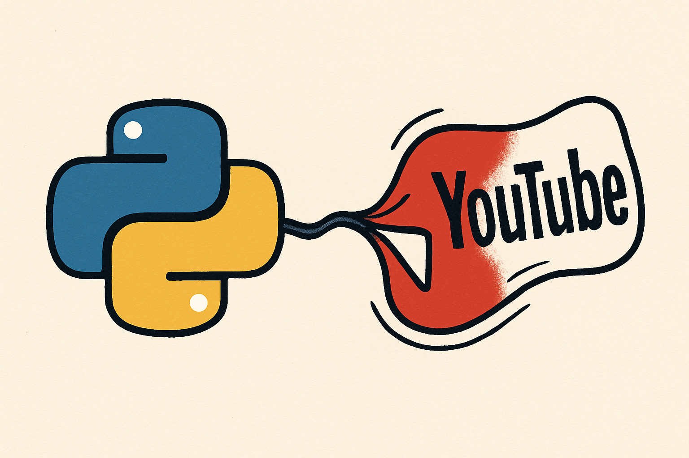

# YouTube Video Downloader



A simple and efficient YouTube video downloader using Python and yt-dlp.

## Description

This project allows downloading YouTube videos with configurable quality. It uses the `yt-dlp` library, which is a maintained and improved version of `youtube-dl`.

## Features

- Download YouTube videos with quality up to 720p
- Extract video information (title, duration, views)
- Robust error handling
- Simple command-line interface

## Prerequisites

- Python 3.8 or higher
- pyenv (recommended for Python version management)
- pip or uv for package management

## Installation and Setup

### 1. Python Environment Setup with pyenv

If you don't have pyenv installed:

```bash
# macOS
brew install pyenv

# Linux
curl https://pyenv.run | bash
```

Configure a specific Python version:

```bash
# Install Python 3.12.6
pyenv install 3.12.6

# Set as global version (optional)
pyenv global 3.12.6

# Set as local version for this project
cd /path/to/your/project
pyenv local 3.12.6
```

### See more

- [Environment setup](docs/ENVIRONMENT_SETUP_EN.md)
- [Package management](docs/PACKAGE_MANAGEMENT_EN.md)

Portuguese version

- [Ambiente de configuração](docs/ENVIRONMENT_SETUP.md)
- [Gerenciamento de pacotes](docs/PACKAGE_MANAGEMENT.md)

### 2. Virtual Environment Creation

```bash
# Create virtual environment
python3 -m venv venv

# Activate virtual environment
# macOS/Linux:
source venv/bin/activate

# Windows:
# venv\\Scripts\\activate
```

### 3. Dependencies Installation

With pip:

```bash
pip install yt-dlp
```

With uv (faster):

```bash
# Install uv first
pip install uv

# Install dependencies with uv
uv pip install yt-dlp
```

## Usage

### Basic Usage

```python
from src.youtube_downloader import download_video

# Download a video
url = "https://www.youtube.com/watch?v=VIDEO_ID"
download_video(url)
```

### Run Script Directly

```bash
# Activate virtual environment
source venv/bin/activate

# Run the script
python src/youtube_downloader.py
```

### Customization

To modify the video URL, edit the `video_url` variable in the `src/youtube_downloader.py` file:

```python
video_url = 'https://www.youtube.com/watch?v=YOUR_URL_HERE'
```

## Project Structure

```bash
vyout/
├── README.md               # This file
├── requirements.txt        # Dependencies
├── .python-version        # Python version (pyenv)
├── docs/                  # 📚 Detailed documentation
│   ├── ENVIRONMENT_SETUP.md     # Portuguese setup guide
│   ├── ENVIRONMENT_SETUP_EN.md  # English setup guide
│   ├── PACKAGE_MANAGEMENT.md    # Portuguese package guide
│   └── PACKAGE_MANAGEMENT_EN.md # English package guide
├── src/                   # 🎯 Main code
│   └── youtube_downloader.py    # Core downloader functionality
├── tests/                 # 🧪 Tests (prepared for future)
└── venv/                  # 🏠 Virtual environment
```

## Available Configurations

The script allows customizing various yt-dlp options:

```python
ydl_opts = {
    'format': 'best[height<=720]',  # Maximum quality 720p
    'outtmpl': '%(title)s.%(ext)s',  # File name
    'writesubtitles': True,          # Download subtitles
    'writeautomaticsub': True,       # Automatic subtitles
}
```

## Troubleshooting

### Import Error

If you receive `ModuleNotFoundError: No module named 'yt_dlp'`:

1. Check if the virtual environment is active
2. Reinstall the dependency: `pip install yt-dlp`

### Download Issues

- Check if the URL is valid
- Some videos may have geographical restrictions
- Private videos cannot be downloaded

### Performance

For faster downloads, consider using `uv` instead of `pip`:

```bash
# Install uv
pip install uv

# Use uv for future installations
uv pip install package-name
```

## Contributing

1. Fork the project
2. Create a branch for your feature
3. Commit your changes
4. Push to the branch
5. Open a Pull Request

## License

This project is for educational use. Respect YouTube's terms of service when using this software.

## Legal Notices

- Use only for content you have permission to download
- Respect copyrights
- This software is provided "as is", without warranties
